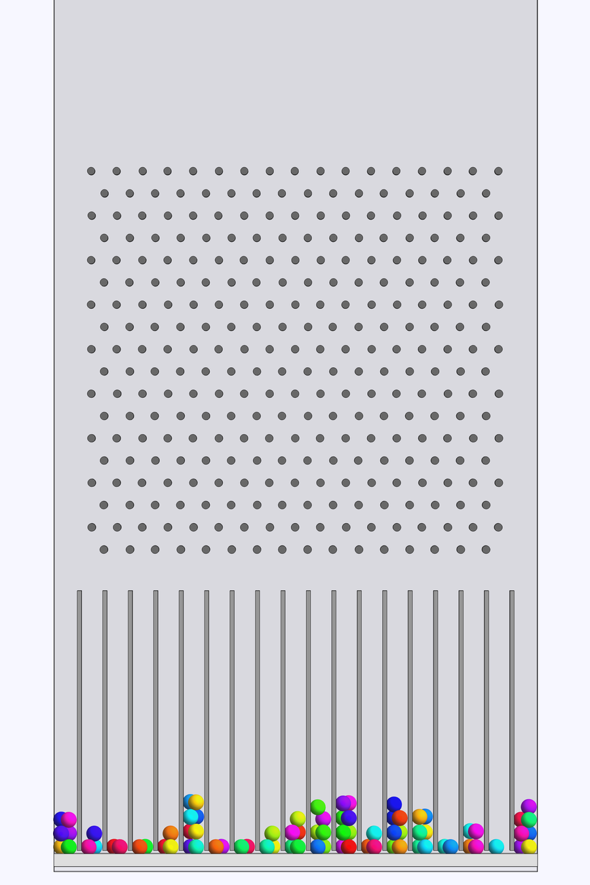
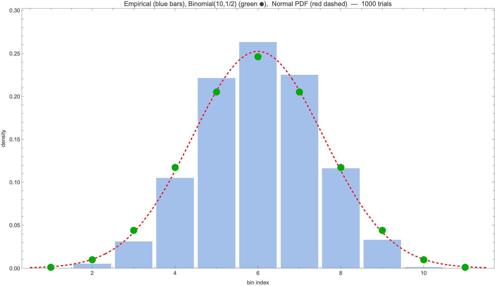

# GaltonBoard

A physically-simulated **Galton Board** (bean machine / quincunx) built in the
Wolfram Language using
[Arnoud Buzing's PhysicsModelLink paclet](https://www.wolframcloud.com/obj/arnoudbuzing/DeployedResources/Paclet/ArnoudBuzing/PhysicsModelLink/),
a thin wrapper around the Rapier rigid-body physics engine.

Balls fall under gravity through a triangular grid of fixed pegs, ricochet,
and accumulate in bins at the bottom. The empirical distribution of the bin
counts matches the Binomial(N, 1/2) predicted by the classical random walk,
and in the limit approaches the Gaussian predicted by the central limit
theorem.



## Layout

```
GaltonBoard/
├── scripts/
│   ├── board.wl              — shared package (GaltonBoard` context)
│   ├── 00_prototype.wls      — smoke test: 1 ball on 1 peg
│   ├── 01_debug_floor.wls    — smoke test: floor collision
│   ├── 02_board_animation.wls — multi-ball animation video
│   ├── 03_histogram.wls      — Monte-Carlo bell-curve simulation
│   ├── 04_trace.wls          — single-ball trajectory trace
│   └── 05_trace_reset.wls    — trace with per-row velocity reset
├── output/                   — generated videos, PNGs and CSV
└── README.md
```

## Prerequisites

* macOS / Linux / Windows with
  [Wolfram Engine](https://www.wolfram.com/engine/) or Mathematica ≥ 14.1,
  including `wolframscript`.
* Install the paclet once:

  ```wolfram
  PacletInstall[ResourceObject["https://wolfr.am/1DvZZLuE7"]]
  ```

## Running

```bash
# physical animation (produces output/02_board_animation.mp4 + a PNG still)
wolframscript -file scripts/02_board_animation.wls

# Monte Carlo histogram (500 default trials; set GBOARD_TRIALS to change)
GBOARD_TRIALS=1000 wolframscript -file scripts/03_histogram.wls
```

## How it works

The paclet wraps Wolfram 3D primitives (`Sphere`, `Cylinder`, `Cuboid`,
`Cone`, `CapsuleShape`) as `DynamicBody` / `FixedBody` handles, hands them
to a Rapier world with `CreatePhysicsModel`, and lets us advance the
simulation with `PhysicsModelIterate` / `PhysicsModelEvolve`.

### The animation (`02_board_animation.wls`)

Drops a small stack of balls through a triangular peg grid (10 rows,
55 pegs) into 11 collection bins separated by thin cuboid walls.
Everything is enclosed by a 2-D-ish slab (thin in the Y direction) made
of six `PhysicsBoundaryBox` walls. The simulation runs at `dt = 1/120 s`
and every 4-th frame is rendered into an MP4 via `PhysicsModelVideo`.

### The statistical simulation (`03_histogram.wls`)

A pure rigid-body simulation does **not** reproduce the Binomial(N, 1/2)
distribution a real Galton board produces: once the top peg deflects a
ball sideways, the ball accumulates enough lateral velocity to fly past
all the remaining peg rows — and with a single-peg deterministic physics
collision the sign of that deflection is decided purely by the initial
x-offset, so the empirical distribution collapses to a bimodal "left or
right edge" shape. See commit `9256bdd..eec8852` for the diagnosis.

The histogram script therefore models the board at its *proper*
mathematical level of abstraction: at each virtual row-crossing it uses
`RapierSetBodyVelocity` to imprint a fresh Bernoulli(±dx/(2·Δt_row))
impulse. Gravity, bin separators, and side walls remain fully physical;
only the ball-peg bounce is replaced by the impulse its expected effect
would give. Over N rows the ball performs a 50/50 random walk of step
size dx/2, and the final bin index is Binomial(N, 1/2) → Normal by CLT.

Results (1000 trials, 10 rows):

```
bin:       1    2    3    4    5    6    7    8    9   10   11
empirical: 0    5   31  105  221  263  225  116   33    1    0
Bin(10,½): 1   10   44  117  205  246  205  117   44   10    1
```

The shape is unambiguously bell-like. `output/03_histogram_overlay.png`:



## License

MIT — do whatever you like with it.
